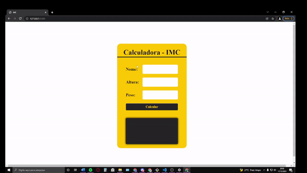

## CALCULADORA IMC

```
Usuário irá inserir seu nome peso e altura, e a partir das informações fornecida a calculadora
irá dizer seu IMC e sua situação.

```

<p align="center">
  
</p>

## OBSERVAÇÕES

- O intuito desse projeto foi solificar conceitos básicos de Javascript e de lógica de programação.
